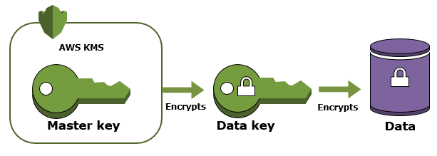
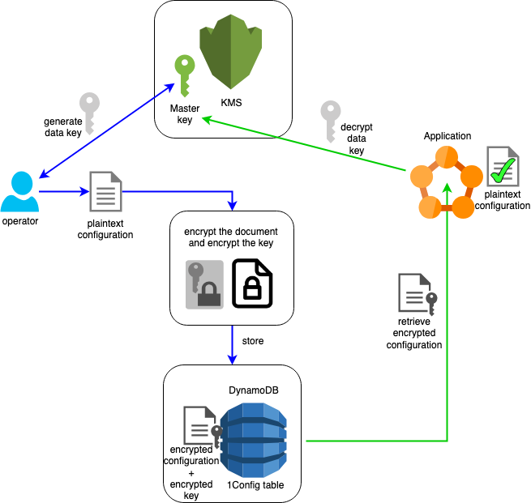

# 1Config
[](https://clojars.org/com.brunobonacci/oneconfig)  

A library to manage multiple environments and application
configuration safely and effectively.  Here some of the key-points and
advantages:

  * Easy way to retrieve and manage configuration for your AWS deployed services
  * Compatible with AWS Lambdas as well
  * AWS KMS double encryption based security (same as S3-SSE, EBS and RDS)
  * Support for multiple environments in the same AWS account
  * Support for multiple services in the same environment
  * Support for multiple concurrent versions of the same service
  * Zero config approach (or at most 1 config `;-)`)
  * *Anti-tampering checks for configuration entries*
  * Supports Clojure, Java, Groovy, and other JVM languages (more to come)
  * Command line tool for managing changes to the configuration
  * Support for local development (outside AWS)
  * Highly-configurable and secure authorization.


## Security model

*1Config* uses the same security model as Amazon S3 server-side
encryption, EBS volumes encryption and Amazon RDS encryption.  It uses
Amazon KMS to generate a **master encryption key** for each
application managed by *1Config*. Then for each configuration entry a
new encryption key is generated, it is used to encrypt the
configuration entry, then the key itself is encrypted using the master
encryption key, and it is stored along with the encrypted payload.



It means that **every configuration entry is encrypted with its own
key**.  With the above strategy we benefit from all the KMS security
features, such as: the ability to rotate keys, we minimalize the
impact of getting one key compromised, and the ability to have fine
grained control on how can access the key to encrypt/decrypt
configuration entries.



The diagram explains how to security model works. Here the steps involved:

  - An operator wants to store a new configuration entry for a application
  - The operator, using the command line tool (`1cfg`) creates a new
    **master encryption key** for the Application.
  - If IAM permissions allow it the operation will succeed.
  - Then it uses the *master encryption key* to generate a data key.
  - The data key will be used to encrypt the plaintext configuration
  - If IAM permissions allow it the operation will succeed.
  - Then the *data key* itself will be encrypted using the *master key*.
  - Finally it stores the encrypted payload and the encrypted data key
    together into DynamoDB table (`1Config`).
  - At this point the operator is done and the application is ready to
    retrieve the configuration.
  - The application will lookup the correct entry for the environment
    and version to use and fetch the encrypted payload with the
    encrypted encryption key.
  - To decrypt the payload it will have to contact KMS and attempt to
    decrypt the data encryption key.
  - If the application has the correct IAM roles to use the master key
    the operation will succeed.
  - Once the data key has bee decrypted by KMS, then the Application
    can decrypt the configuration payload and retrieve the plaintext
    information.
  - **Luckly, all above steps are done automatically by `1Config`.**

## Quick start.

Quick start guide to use 1Config.

  * Install command line tool via [Homebrew](https://brew.sh/)
  ``` bash
  brew tap BrunoBonacci/lazy-tools
  brew install one-config
  ```

  * Otherwise use the Manual installation
  ``` bash
  mkdir -p ~/bin
  wget https://github.com/BrunoBonacci/1config/releases/download/0.10.2/1cfg -O ~/bin/1cfg
  chmod +x ~/bin/1cfg
  export PATH=~/bin:$PATH
  ```
  * Initialize AWS ENV variables
  ``` bash
  export AWS_ACCESS_KEY_ID=xxx
  export AWS_SECRET_ACCESS_KEY=yyy
  export AWS_DEFAULT_REGION=eu-west-1
  ```
  * Initialize DynamoDB table (only the first time)
  ``` bash
  1cfg INIT -b dynamo
  ```
  * Set your first secure configuration for application `hello-world`
  ``` bash
  1cfg SET -b dynamo -k hello-world -e test -v 1.0.0 -t txt 'secret password'
  ```
  * List the available configurations
  ``` bash
  1cfg LIST
  ```
  * Retrieve the configuration with the command line tool
  ``` bash
  1cfg GET -b dynamo -k hello-world -e test -v 1.0.0
  ```
  * Retrieve the configuration via the API in your application
  ``` clojure
  (require '[com.brunobonacci.oneconfig :refer [configure]])
  (configure {:key "hello-world" :version "1.0.0" :env "test"})
  ```

There is support for `edn`, `txt`, `json` and Java `properties` format.
and supports Clojure, Java, Groovy, and other JVM languages (more to come)

## Usage with Clojure

In order to use the library add the dependency to your `project.clj`

``` clojure
;; Leiningen project
[com.brunobonacci/oneconfig "0.10.2"]

;; deps.edn format
{:deps { com.brunobonacci/oneconfig "0.10.2" }}
```

Latest version: [](https://clojars.org/com.brunobonacci/oneconfig)


Then require the namespace:

``` clojure
(ns foo.bar
  (:require [com.brunobonacci.oneconfig :refer [configure]]))
```

Finally get the configuration for your service.

``` clojure
(configure {:key "service-name" :version "1.2.3" :env "prod"})
;;=> {...}
```


## Usage with Java

In order to use the client library add the
[Clojars.org](https://clojars.org/) Maven repository in your `pom.xml`
and add the dependency:

Add the repository:
``` xml
<repository>
  <id>clojars.org</id>
  <url>https://clojars.org/repo</url>
</repository>
```

Then add the dependency

``` xml
<!-- https://mvnrepository.com/artifact/com.brunobonacci/oneconfig -->
<dependency>
    <groupId>com.brunobonacci</groupId>
    <artifactId>oneconfig</artifactId>
    <version>0.10.2</version>
</dependency>
```
Latest version: [](https://clojars.org/com.brunobonacci/oneconfig)


Then import the client, and request the configuration entry wanted:

``` java
// add the import
import com.brunobonacci.oneconfig.client.OneConfigClient;
import com.brunobonacci.oneconfig.client.OneConfigClient.ConfigEntry;
// ....

// then in your code retrieve the config:
ConfigEntry config = OneConfigClient.configure("service1", "dev", "1.8.0");

// check if configuration is found
if ( config == null )
    throw new RuntimeException("Unable to load configuration");

// retrieve the value:
config.getValueAsString();        // for txt entries
config.getValueAsProperties();    // for properties entries
config.getValueAsJsonMap();       // Map<String, Object> for json entries
config.getValueAsEdnMap();        // Map<Keyword, Object> for edn entries
```


### Best practices

In this section we will discuss some of the best practices managing
configurations for your system.

Firstly, define a **default configuration**, document the various
configuration options and set defaults which are best suited for a
production environment.  **Don't put secrets in here!!!**. If you have
username, passwords, or appilcation keys don't add them in the
defaults values (see database username/password)

``` clojure
(ns your.namespace
  (:require [com.brunobonacci.oneconfig :refer :all]
            [clojure.java.io :as io]
            [clojure.string :as str]))

;; default configuration, values defined here
;; should be the one you wish to use in a
;; production environment.
(def ^:const DEFAULT-CONFIG
  { ;; HTTP server listener configuration
   :server   {:port 80 :bind "0.0.0.0"}

   ;; database connection configuration
   :database {:host "mydatabase" :port 1234
              :dbname "mydata"
              ;; REQUIRED!!!
              ;;:user "username"
              ;;:pasword "secret"
              :use-encryption true
              :connection-pool-size 10}

   ;; application limits
   :limits {:max-items-x-page  25
            :max-login-attempt 5
            :max-session-time  300000
            :max-idle-time     60000
            :max-upload-size   8000000}

   ;; Deep storage configuration
   :media-storage {:type   :s3
                   :bucket "my-media-storage"
                   :prefix "media/storage/"}
   })

```

Once you defined a good default configuration you need to retrieve
which environment you are running on. This information might come from
different places and it mostly depends on how you deploy your
software. Let's assume that we have environment variable called `$ENV`
(could be different) which contains the current environment, if the
environment variable is not present then we assume a developer
machine.

``` clojure

(defn env
  "returns the current environmet the system is running in.
   This has to be provided by the infrastructure"
  []
  (or (System/getenv "ENV") "dev"))

```

Next we need to retrieve which version our system is currently on.
Again you might store this information in various way, the simplest
one which I recommend to use is to store it in a resource file in your
`resources/` folder, something like `<your-project-name>.versoin` and
then read it from your system as below.  This approach allows you to
have only one place where you write the version number as you can use
the same file for your `project.clj` version.  Please see the
following link for a leiningen example: https://github.com/BrunoBonacci/1config/blob/master/1config-core/project.clj

``` clojure
;;
;; Better to store the version of the project as a resource file
;;
(defn version
  "returns the version of the current version of the project
   from the resource bundle."
  []
  (some->> (io/resource "my-project.version")
           slurp
           str/trim))
```

Finally, you can retrieve the user configuration and merge it with
the default configuration as below:

``` clojure
;; Overall system config
(defonce config
  (->> (configure {:key "system1" :env (env) :version (version)})
     (deep-merge DEFAULT-CONFIG)))
```

Assuming that the user configuration looks like this:

``` clojure
{:server {:port 9000}
 :database {:user "testuser" :password "testpass"}}
```

Then the final, overall `config` will look like the following:

``` clojure
{:server {:port 9000, :bind "0.0.0.0"},
 :database
 {:host "mydatabase",
  :port 1234,
  :dbname "mydata",
  :use-encryption true,
  :connection-pool-size 10,
  :user "testuser",
  :password "testpass"},
 :limits
 {:max-items-x-page 25,
  :max-login-attempt 5,
  :max-session-time 300000,
  :max-idle-time 60000,
  :max-upload-size 8000000},
 :media-storage
 {:type :s3, :bucket "my-media-storage", :prefix "media/storage/"}}
```

Please note that the `:port`, the `:user` and the `:password` reflect
the user choice while the other keys are as defined in the
`DEFAULT-CONFIG`.

Now to set the user configuration you could use the `1cfg` command
line tool to set the value, however it is recommended that the you
keep the `dev` configuration only on your machine and you don't set it
in the shared DynamoDB table. The reason why this is best is because
different developers might need different configurations.

Luckily, **1Config** solves this problem by allowing you to have a
file-system configuration which overrides values from the DynamoDB
(see configuration providers below).  There are many options, however
the best suited for development purposes is to create a file in your
home directory with the following template `~/.1config/<service-key>/<env>/<version>/<service-key>.<ext>`

``` bash
# template ~/.1config/<service-key>/<env>/<version>/<service-key>.<ext>
mkdir -p ~/.1config/system1/dev/1.0.0/

# and create a fine with your configuration inside
cat > ~/.1config/system1/dev/1.0.0/system1.edn <<\EOF
;; my dev config
{:server {:port 9000}
 :database {:user "testuser" :password "testpass"}}
EOF
```

With this configuration file in place **1Config** will use as value
for the configuration ignoring possible other matching entries in the
dynamo table.

It is possible to test it via the command line tool:

``` bash
$ 1cfg GET -k system1 -e dev -v 1.0.0

;; my dev config
{:server {:port 9000}
 :database {:user "testuser" :password "testpass"}}
```

The advantage of this approach, is that the configuration lives
outside of the project directory structure so it won't be committed in
your version control system accidentally revealing your secrets to
other people.

It is good practice to keep the development environment separated from
the other environments. You can pick a name/label like `dev` or
`local` (or anything else) and just use it for your local development.

For development purposes, if you wish to use only the filesystem based
configuration provider (see below) you can either set the environment
variable `ONECONFIG_DEFAULT_BACKEND` or the JVM system property
`1config.default.backend` with the value `fs` (for example:
`export ONECONFIG_DEFAULT_BACKEND=fs` **to be used for development
purposes only**).


### Configuration providers

`configure` will try a number of different location to find a configuration provider.
It will attempt to read a file or dynamo table in the following order.

  * Java System property `1config.file`, if set and the file exists
    it will be used as *sole* configuration
  * Environment variable `$ONECONFIG_FILE`, if set and the file exists
    it will be used as *sole* configuration
  * Java Resource bundle `1config.edn` (or `.json`, `.txt`,
    `.properties`), if present it will be used as *sole* configuration
  * `~/.1config/<service-key>/<env>/<version>/<service-key>.<ext>`
    (home dir) - if present it will be used as configuration.
    Entries in the `~/.1config/` will have precendence over the DynamoDB table.
  * DynamoDB table called `1Config` in the "current" region.

The name of the DynamoDB table can be customized with
`$ONECONFIG_DYNAMO_TABLE` environment variable (or
`1config.dynamo.table` property).  It will use the machine role to
access the database. The AWS region can be controlled via the
environment variable `$AWS_DEFAULT_REGION`. For the AWS credentials we
use the [Default Credential Provider
Chain](http://docs.aws.amazon.com/sdk-for-java/v1/developer-guide/credentials.html#id6).
Therefore the credentials can be provided in one of the following
ways:

  - **Environment Variables** – `AWS_ACCESS_KEY_ID` and
    `AWS_SECRET_ACCESS_KEY`. The AWS SDK for Java uses the
    `EnvironmentVariableCredentialsProvider` class to load these
    credentials.

  - **Java System Properties** – `aws.accessKeyId` and
    `aws.secretKey`. The AWS SDK for Java uses the
    `SystemPropertiesCredentialsProvider` to load these credentials.

  - **The default credential profiles file** – typically located at
    `~/.aws/credentials` (this location may vary per platform), this
    credentials file is shared by many of the AWS SDKs and by the AWS
    CLI. The AWS SDK for Java uses the ProfileCredentialsProvider to
    load these credentials.

    You can create a credentials file by using the aws configure
    command provided by the AWS CLI, or you can create it by
    hand-editing the file with a text editor. For information about
    the credentials file format, see AWS Credentials File Format.

  - Instance profile credentials – these credentials can be used on
    EC2 instances, and are delivered through the Amazon EC2 metadata
    service. The AWS SDK for Java uses the
    `InstanceProfileCredentialsProvider` to load these credentials.


### Configuration resolution.

A configuration entry is uniquely identified by **key, environment and version**.
While resolving the specific configuration the system if going  to look for a
exact version match or a version which is smaller than the given one.

For this reason you don't have to publish a new configuration for every
version change. For example: let's assume you have the following data.

| Config key | Env   | Version  | value                                                          |
|------------|-------|----------|----------------------------------------------------------------|
| `service1` | `dev` | `2.1.0`  | `{:host "localhost", :port 1234}`                              |
| `service1` | `dev` | `3.7.0`  | `{:host "my.db.local" :port 1234 :user "test2" :pass "test2"}` |
| `service1` | `dev` | `3.10.0` | `{:host "my.db.local" :port 1234 :user "foo" :pass "bar"}`     |
|            |       |          |                                                                |


If you ask of a precisely matching configuration you get that specific
config entry or nil if not found:

``` clojure
;; key not found
(configure {:key "system-not-present" :env "dev" :version "3.1.0"})
;;=> nil


;; exact match
(configure {:key "system1" :env "dev" :version "2.1.0"})
;;=>
;; {:content-type "edn",
;;  :env "dev",
;;  :key "system1",
;;  :version "2.1.0",
;;  :value {:host "localhost", :port 1234},
;;  :change-num 0}

```

If an exact match isn't found the system retrieve the previous
configuration is available

``` clojure
;; exact match not found, but previous version found
;; even across major versions
(configure {:key "system1" :env "dev" :version "3.6.2"})
;;=>
;; {:content-type "edn",
;;  :env "dev",
;;  :key "system1",
;;  :version "2.1.0",
;;  :value {:host "localhost", :port 1234},
;;  :change-num 0}


;; if there aren't previous versions it returns nil
(configure {:key "system1" :env "dev" :version "1.1.0"})
;;=> nil

;; exact match not found, but previous version found
;; in this case the most recent (previous) version is selected.

(configure {:key "system1" :env "dev" :version "3.8.0"})
;;=>
;; {:content-type "edn",
;;  :env "dev",
;;  :key "system1",
;;  :version "3.7.0",
;;  :value {:host "my.db.local", :port 1234, :user "test2", :pass "test2"},
;;  :change-num 0}

```

As mentioned earlier, versions are sorted by numerical elements and not
by alphanumeric values.


### File based configuration.

This is mostly intended for local development, you can create a files
under `~/.1config/` (in your home) and put the configuration for one
or more services in one or more environments with the following
format: `~/.1config/<service-key>/<env>/<version>/<service-key>.<ext>`

For example, these are all valid entries:

  - `~/.1config/service1/dev/3.2.0/service1.edn`
  - `~/.1config/service1/dev/3.10.6/service1.txt`
  - `~/.1config/user-database/dev/1.0.0/user-database.properties`
  - `~/.1config/service1/staging/3.10.6/service1.json`

The intended use of the configuration in `~/.1config/` is to facilitate
development and allow the service to start with a local configuration
which doesn't reside in your code.


### Master keys management

Amazon KMS keys are automatically generated by the command line tool
when the first configuration entry for a new application is created.

**1Config** creates a KMS key and an alias with the same name as the
application `key` used for the configuration.  All keys created by
`1Config` are prefixed with `1Config/`, for example if your
application key is `user-profile-service` then the master key alias
will be `alias/1Config/user-profile-service`.  Keys are created in the
same region as the DynamoDB table, keys can be set to automatically
rotate. You can list the `1Config` managed keys via the command line
tools with: `1cfg list-keys`. Master keys can also be listed via the
AWS command line tool with: `$ aws kms list-keys` and `$ aws kms list-aliases`
or via the AWS console.

To create a new key you can use the *1Config* command line tool
with `1cfg create-key -m key-name` (eg: `1cfg create-key -m user-profile-service`)

You can also use encrypt a config entry with a key with different name
by specifying the key to use during set, for example:

    1cfg SET -b dynamo -e test -k 'service1' -v '1.6.0' -t edn '{:port 8080}' -m user-profile-service

### Limitations

There are a number of limitations to consider:

  * 1Config doesn't support `SNAPSHOT` versions, and I don't
    believe there is any valid use case for supporting them, so you
    must strip the `-SNAPSHOT` prior the call to `configure`.
  * 1Config only supports three-legged numerical versions such
    as `"1.12.2"` no other version qualifiers such as `alpha`, `beta`
    etc.


## Command line tool (`1cfg`)

`1Config` comes with a command line tool which allows you to
initialise and set values in the given backend.

Download latest release from github and save it in your `~/bin` folder:

  * https://github.com/BrunoBonacci/1config/releases

**NOTE: It requires JDK/JRE 8+ to be installed and in the PATH.**

Then give it permissions to run:

``` shell
chmod -x ~/bin/1cfg
```

Here how to use it:

``` text

  A command line tool for managing configurations in different environments.

Usage:

   1cfg <OPERATION> -e <ENVIRONMENT> -k <SERVICE> -v <VERSION> [-b <BACKEND>] [-t <TYPE>] <VALUE>

   WHERE:
   ---------

   OPERATION:
      - GET        : retrieve the current configuration value for
                   : the given env/service/version combination
      - SET        : sets the value of the given env/service/version combination
      - LIST       : lists the available keys for the given backend
      - INIT       : initialises the given backend (like create the table if necessary)
      - LIST-KEYS  : lists the master encryption keys created by 1Config.
      - CREATE-KEY : creates an master encryption key.

   OPTIONS:
   ---------
   -h   --help                 : this help
        --stacktrace           : To show the full stacktrace of an error
   -b   --backend   BACKEND    : Must be one of: hierarchical, dynamo, fs. Default: hierarchical
   -e   --env   ENVIRONMENT    : the name of the environment like 'prod', 'dev', 'st1' etc
   -k   --key       SERVICE    : the name of the system or key for which the configuration if for,
                               : exmaple: 'service1', 'db-pass' etc
   -v   --version   VERSION    : a version number for the given key in the following format: '2.12.4'
   -c   --change-num CHANGENUM : used with GET returns a specific configuration change.
   -f   --content-file FILE    : read the value to SET from the given file.
        --with-meta            : whether to include meta data for GET operation
        --output-format FORMAT : either 'table' or 'cli' default is 'table' (only for list)
   -C                          : same as '--output-format=cli'
   -X   --extented             : whether to display an extended table (more columns)
   -P   --pretty-print         : whether to pretty print the configuration values
   -o   --order-by     ORDER   : The listing order, must be a comma-separated list
                               : of one or more of: 'key', 'env', 'version', 'change-num'
                               : default order: 'key,env,version,change-num'
   -t   --content-type TYPE    : one of 'edn', 'txt' or 'json', 'properties' or 'props'
                               : default is 'edn'
   -m   --master-key  KEY-NAME : The master encryption key to use for encrypting the entry.
                               : It must be a KMS key alias or an arn identifier for a key.

Example:

   --- keys management ---

   (*) List KMS encryption keys managed by 1Config
   1cfg LIST-KEYS

   (*) Create a master encryption key, the key name must be the same
       and the configuration key to be used automatically.
   1cfg CREATE-KEY -m 'service1'

   --- configuration entries management  ---

   (*) To initialise a given backend
   1cfg INIT -b dynamo

   (*) To set the configuration value of a service called 'service1' use:
   1cfg SET -b dynamo -e test -k 'service1' -v '1.6.0' -t edn '{:port 8080}'

   (*) To read last configuration value for a service called 'service1' use:
   1cfg GET -b dynamo -e test -k 'service1' -v '1.6.0'

   (*) To read a specific changeset for a service called 'service1' use:
   1cfg GET -b dynamo -e test -k 'service1' -v '1.6.0' -c '3563412132'

   (*) To list configuration with optional filters and ordering
   1cfg LIST -b dynamo -e prod -k ser -v 1. -o env,key


NOTE: set AWS_ACCESS_KEY_ID, AWS_SECRET_ACCESS_KEY or AWS_PROFILE to
      provide authentication access to the target AWS account.
      set AWS_DEFAULT_REGION to set the AWS region to use.

```

### AWS permissions

If you are using role based permissions then ensure that your role
has the following permissions included:

* Permissions for Command line tool user

``` json
{
    "Version": "2012-10-17",
    "Statement": [
        {
            "Sid": "AllowInitDatabase",
            "Effect": "Allow",
            "Action": "dynamodb:CreateTable",
            "Resource": "arn:aws:dynamodb:*:*:table/1Config"
        },
        {
            "Sid": "AllowListAllConfigEntries",
            "Effect": "Allow",
            "Action": "dynamodb:Scan",
            "Resource": "arn:aws:dynamodb:*:*:table/1Config"
        },
        {
            "Sid": "AllowCreateKeysAndListKeys",
            "Effect": "Allow",
            "Action": [
                "kms:CreateAlias",
                "kms:CreateKey",
                "kms:DescribeKey",
                "kms:ListAliases"
            ],
            "Resource": "*"
        },
        {
            "Sid": "AllowGetConfigEntriesPt1",
            "Effect": "Allow",
            "Action": [
                "dynamodb:Query"
            ],
            "Resource": "arn:aws:dynamodb:*:*:table/1Config"
        },
        {
            "Sid": "AllowSetOnConfigEntryPt1",
            "Effect": "Allow",
            "Action": [
                "dynamodb:PutItem"
            ],
            "Resource": "arn:aws:dynamodb:*:*:table/1Config"
        },
        {
            "Sid": "AllowGetConfigEntriesPt2",
            "Effect": "Allow",
            "Action": "kms:Decrypt",
            "Resource": "*"
        },
        {
            "Sid": "AllowSetOnConfigEntryPt2",
            "Effect": "Allow",
            "Action": [
                "kms:GenerateDataKey"
            ],
            "Resource": "*"
        }
    ]
}
```

**NOTE: if you are running 1Config version <= 0.9.2** you need to add
one more permission.

``` json
   [...]
        {
            "Sid": "AllowDiscoverThemselves",
            "Effect": "Allow",
            "Action": [
                "iam:GetUser"
            ],
            "Resource": "arn:aws:iam::*:user/${aws:username}"
        }
   [...]
```


A simple way to limit which keys can be used by the user/profile
attached to this policy is to list the arn of the keys it can use
(ARNs can be obtained with `1cfg list-keys`):

``` json
   [...]
        {
            "Sid": "AllowGetConfigEntriesPt2",
            "Effect": "Allow",
            "Action": "kms:Decrypt",
            "Resource": [
                "arn:aws:kms:eu-west-1:1234567890:key/aaaaaaa-bbbb-cccc-ddddd-11111111111",
                "arn:aws:kms:eu-west-1:1234567890:key/aaaaaaa-bbbb-cccc-ddddd-22222222222",
                "arn:aws:kms:eu-west-1:1234567890:key/aaaaaaa-bbbb-cccc-ddddd-33333333333"
            ]
        },
        {
            "Sid": "AllowSetOnConfigEntryPt2",
            "Effect": "Allow",
            "Action": [
                "kms:GenerateDataKey"
            ],
            "Resource": [
                "arn:aws:kms:eu-west-1:1234567890:key/aaaaaaa-bbbb-cccc-ddddd-11111111111",
                "arn:aws:kms:eu-west-1:1234567890:key/aaaaaaa-bbbb-cccc-ddddd-22222222222",
                "arn:aws:kms:eu-west-1:1234567890:key/aaaaaaa-bbbb-cccc-ddddd-33333333333"
            ]
        }
   [...]
```

* Permissions for the application

``` json
{
    "Version": "2012-10-17",
    "Statement": [
        {
            "Sid": "AllowGetConfigEntriesPt1",
            "Effect": "Allow",
            "Action": [
                "dynamodb:Query"
            ],
            "Resource": "arn:aws:dynamodb:*:*:table/1Config"
        },
        {
            "Sid": "AllowGetConfigEntriesPt2",
            "Effect": "Allow",
            "Action": "kms:Decrypt",
            "Resource": "*"
        }
    ]
}
```

Similarly the application can be limited to the key used for its own entries:

``` json
   [...]
        {
            "Sid": "AllowGetConfigEntriesPt2",
            "Effect": "Allow",
            "Action": "kms:Decrypt",
            "Resource": "arn:aws:kms:eu-west-1:1234567890:key/aaaaaaa-bbbb-cccc-ddddd-33333333333"
        }
   [...]
```


## Terraform scripts

If you are using [terraform](https://www.terraform.io/) to manage your
infrastructure, and you wish to create the `1Config` DynamoDB table as
a terraform resource, here there is a snippet with the configuration
required.

``` terraform
##
## Creates a dynamodb table for 1Config configuration tool
##

variable "table_name" {
  default = "1Config"
}

variable "read_capacity" {
  default = "10"
}

variable "write_capacity" {
  default = "5"
}

variable "tags" {
  default = {}
}


resource "aws_dynamodb_table" "config_table" {
  name           = "${var.table_name}"
  billing_mode   = "PAY_PER_REQUEST"
  ## billing_mode   = "PROVISIONED"
  ## read_capacity  = "${var.read_capacity}"
  ## write_capacity = "${var.write_capacity}"
  hash_key       = "__sys_key"
  range_key      = "__ver_key"

  # enable Point-in-time Recovery
  point_in_time_recovery {
    enabled = true
  }

  attribute {
    name = "__sys_key"
    type = "S"
  }

  attribute {
    name = "__ver_key"
    type = "S"
  }

  tags   = "${var.tags}"
}


output "config_table_id"{
  value = "${aws_dynamodb_table.config_table.id}"
}

output "config_table_arn"{
  value = "${aws_dynamodb_table.config_table.arn}"
}

```

## User profiles

User profiles allow to set common information for a single
user/operator.  By creating a file `~/.1config/user-profiles.edn` you
can set some of the following options:

### User restrictions

In large teams you might want to add some constraints on naming
conventions or the name of the environment you are allowed to set.
Sometimes you might want to simply avoid common mistakes that
operators do, such as setting the wrong name or setting the wrong
content-type.

For all these cases you can constraint the use of `1cfg` with the
`:restrictions` key in the `user-profiles.edn`.

The restrictions allow to add constraints on the `1cfg SET` function.
For example you might want to introduce naming conventions, or for
example you might want to limit which environment is used in a
specific AWS account. Finally you can also avoid the common mistake of
setting a config entry with the wrong type.

All these can be constraint with the user of `:restrictions` in the
`user-profiles.edn`

The general structure of the restrictions is:

``` clojure
{:restrictions
 [
 ;; guard :-> restriction :message "Display message"
 ]}

```

Restrictions is a list of conditions. All will be tested.  The first
is the `guard` condition, which means that the `restriction` will
tested only if the `guard` condition is matched.

For example:

``` clojure
  ;; guard                  ;->  restriction                  :messsage "error to display"
  [:account :matches? ".*"] :->  [:key :matches-exactly? "[a-z][a-z0-9-]+"]
  :message "Invalid service name, shoulbe lowercase letters, numbers and hypens (-)"
```

This restriction imposes that for all accounts the `:key` should only
include lower-case letters and number with hyphens starting with a
letter.  The guard condition `[:account :matches? ".*"]` will match
all the AWS accounts including the `"local"` (when using the backend
`:fs`) and ensure that the `[:key :matches-exactly?
"[a-z][a-z0-9-]+"]`.  If this restriction test fails during a `1cfg
SET` operation then the given message will be displayed:

``` bash
$ 1cfg -b fs -e whatever -k 1bar -v 1.0.0 -t txt set 'hi'
ERROR: RESTRICTION: Invalid service name, shoulbe lowercase letters, numbers and hypens (-)
CAUSE: RESTRICTION: Invalid service name, shoulbe lowercase letters, numbers and hypens (-)
```

**NOTE**: The `RESTRICTION:` prefix is added to clarify that this
error comes from a failed restriction.

For example if you which to restrict the name of the environments
to be used for a particular account add:

``` clojure
  ;; AWS account number
  [:account :matches? "11111111111111"] :-> [:env :in? ["dev" "int" "uat" "prd"]]
  :message "Invalid environment, only dev, int, uat and prd are allowed"
```

If you wish to restrict the configuration type for a specific key you can use:

``` clojure
  ;; Ensure that `user-service` is always set with the corrent content-type
  [:key :is? "user-service"] :-> [:content-type :is? ""]
  :message "Invalid content type for user-service."
```

The available fields during the SET operations are:
`:env`,`:key`,`:version`,`:content-type`,`:value` and `:master-key`
when provided.
The available operators for the conditions are:

| Comparator        | Complement (not)      | Case-insensitive  | Insensitive Complement |
| -------------     | -----------------     | ----------------  | ---------------------- |
| :is?              | :is-not?              | :IS?              | :IS-NOT?               |
| :starts-with?     | :not-starts-with?     | :STARTS-WITH?     | :NOT-STARTS-WITH?      |
| :ends-with?       | :not-ends-with?       | :ENDS-WITH?       | :NOT-ENDS-WITH?        |
| :contains?        | :not-contains?        | :CONTAINS?        | :NOT-CONTAINS?         |
| :in?              | :not-in?              | :IN?              | :NOT-IN?               |
| :matches?         | :not-matches?         | :MATCHES?         | :NOT-MATCHES?          |
| :matches-exactly? | :not-matches-exactly? | :MATCHES-EXACTLY? | :NOT-MATCHES-EXACTLY?  |
|                   |                       |                   |                        |

Conditions can be also logically grouped with `:and` and `:or`, for
more info see: https://github.com/BrunoBonacci/where

To retrieve your aws account number using the AWS cli run:

``` bash
$ export AWS_PROFILE=chage_profile_if_needed
$ aws sts get-caller-identity --output json
{
    "UserId": "AIDAJHGJHGKJGJHGJH",
    "Account": "111111111111",
    "Arn": "arn:aws:iam::111111111111:user/operator"
}
```

Please note that the purpose of `:restrictions` in `user-profiles.edn`
is to avoid user mistakes not to limit capabilities. For this reason
the user can bypass a given restriction by commenting it in it's local
file.

## License

Copyright © 2019 Bruno Bonacci - Distributed under the [Apache License v2.0](http://www.apache.org/licenses/LICENSE-2.0)
