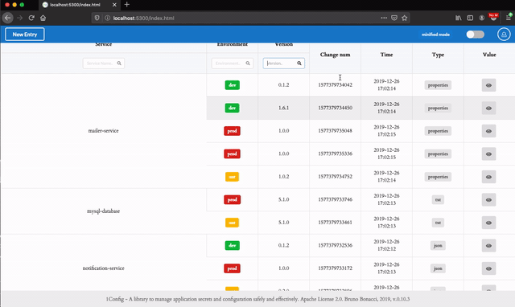

# 1Config
  

**A tool and a library to manage application secrets and configuration safely and effectively.**

Here some of the key-points and advantages:

  * Easy way to retrieve and manage configuration for your AWS deployed services
  * Compatible with AWS Lambdas as well
  * AWS KMS envelope encryption for extra security (same as S3-SSE, EBS and RDS)
  * Support for key-rotation
  * Highly available (as available as DynamoDB + KMS)
  * Support for multiple environments in the same AWS account
  * Support for multiple services in the same environment
  * Support for multiple concurrent versions of the same service
  * Zero config approach (or at most 1 config `;-)`)
  * *Anti-tampering checks for configuration entries* (entries can't be manipulated manually)
  * Supports Clojure, Java, Groovy, and other JVM languages (more to come)
  * Command line tool for managing changes to the configuration
  * Graphical User interface for managing changes to the configuration
  * Support for local development (outside AWS)
  * Highly-configurable and secure authorization.

*Now available with a GUI as well:*

(*Many thanks to [Eugene Tolbakov @etolbakov](https://github.com/etolbakov)*)

## Security model

*1Config* uses the same security model as Amazon S3 server-side
encryption, EBS volumes encryption and Amazon RDS encryption.  It uses
Amazon KMS to generate a **master encryption key** for each
application managed by *1Config*. Then for each configuration entry a
new encryption key is generated, it is used to encrypt the
configuration entry, then the key itself is encrypted using the master
encryption key, and it is stored along with the encrypted payload.

It means that **every configuration entry is encrypted with its own
key**.  With the above strategy we benefit from all the KMS security
features, such as: the ability to rotate keys, we minimalize the
impact of getting one key compromised, and the ability to have fine
grained control on how can access the key to encrypt/decrypt
configuration entries.

The diagram explains how to security model works. Here the steps involved:

  - An operator wants to store a new configuration entry for a application
  - The operator, using the command line tool (`1cfg`) creates a new
    **master encryption key** for the Application.
  - If IAM permissions allow it the operation will succeed.
  - Then it uses the *master encryption key* to generate a data key.
  - The data key will be used to encrypt the plaintext configuration
  - If IAM permissions allow it the operation will succeed.
  - Then the *data key* itself will be encrypted using the *master key*.
  - Finally it stores the encrypted payload and the encrypted data key
    together into DynamoDB table (`1Config`).
  - At this point the operator is done and the application is ready to
    retrieve the configuration.
  - The application will lookup the correct entry for the environment
    and version to use and fetch the encrypted payload with the
    encrypted encryption key.
  - To decrypt the payload it will have to contact KMS and attempt to
    decrypt the data encryption key.
  - If the application has the correct IAM roles to use the master key
    the operation will succeed.
  - Once the data key has bee decrypted by KMS, then the Application
    can decrypt the configuration payload and retrieve the plaintext
    information.
  - **Luckly, all above steps are done automatically by `1Config`.**

## What's next?
  * See the [Quick Start](./doc/quick-start.md) guide to install
  * Check the [Command line tool](./doc/cli-tool.md)
  * Read the [Best Practices](./doc/best-practices.md)
  * Check the [full documentation online](https://cljdoc.org/jump/release/com.brunobonacci/oneconfig)

## Contributors

Many thanks to all the contributors to this project, to those who
helped to shape it with their ideas, testing, suggestions, and PRs.

A very special thanks to:

  - [Eugene Tolbakov @etolbakov](https://github.com/etolbakov)

## License

Copyright © 2019-2020 Bruno Bonacci - Distributed under the [Apache License v2.0](http://www.apache.org/licenses/LICENSE-2.0)
